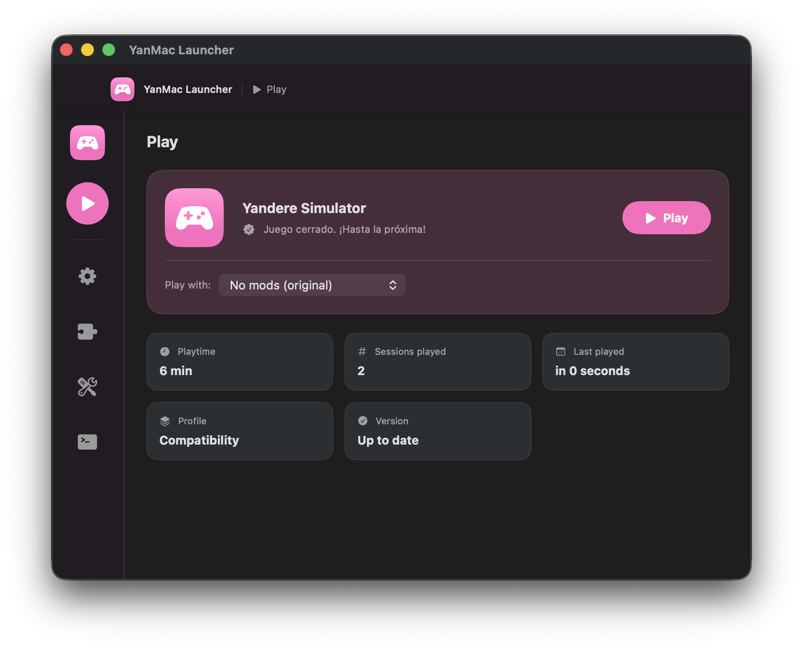
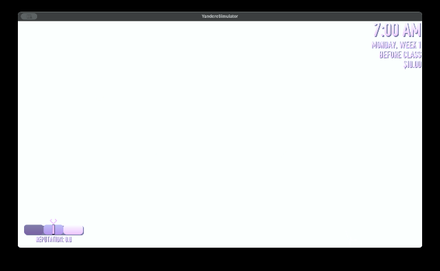
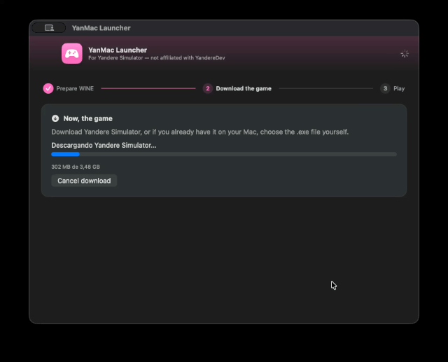
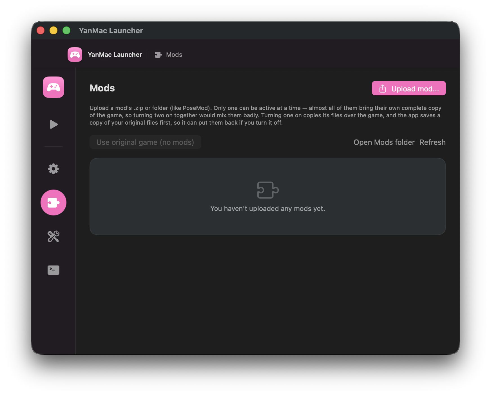
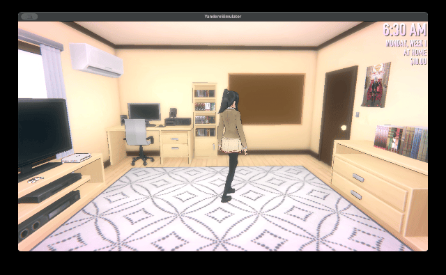

# YanMac Launcher

A native macOS app for playing **Yandere Simulator** without touching the Terminal. Point it at nothing, and it sets up everything needed to run the Windows game on your Mac — WINE, the compatibility patch, the fonts, the game itself — then gets out of your way.

> **Disclaimer:** This project is **not affiliated with, endorsed by, or associated with YandereDev** or the official Yandere Simulator project in any way. It's an independent, fan-made launcher. Yandere Simulator itself is downloaded from its [official source](https://yanderesimulator.com) — this launcher doesn't bundle, modify, or redistribute the game.



## Features

**Zero-setup install**
A guided, three-step wizard — Prepare WINE → Download the game → Play — handles Homebrew, WINE/Game Porting Toolkit, and the Unity 6 compatibility patch automatically. No command line required.



**One-click game management**
Download, update, verify, repair, or fully reinstall the game from inside the app. Real progress bars for every long operation (install, download, extraction, mod upload, file verification) — never just a frozen spinner.



**Mod support**
Import mods as a `.zip` or a folder, enable or disable them individually, and roll back to a clean vanilla install whenever you want.



**Backups**
Back up your save data or the entire game folder with one click, so a bad mod or a broken update never costs you progress.

**Smart diagnostics**
If the game crashes or closes early, the launcher reads the WINE/Metal logs and tells you in plain language what likely went wrong — a missing file, a graphics issue, Rosetta, disk space — instead of leaving you with a wall of log text. A built-in "Copy diagnostic report" button gives you everything needed to ask for help in one paste.

**Frozen-game detection**
If the game stops responding (common during cutscenes), the launcher notices and offers a safe "Force Quit" instead of making you guess whether to wait it out.

**Graphics profiles**
Switch between graphics presets (or fine-tune manually) without editing config files, including an optional native macOS FPS overlay (Metal HUD) to compare performance.

**Safe by default**
Won't let you accidentally open two copies at once, warns you before closing while something's running, and cleans up after itself.

**Light/dark theme, English & Spanish interface, play-time stats.**

## Known issues

- **Some in-game text doesn't render** (dialogue boxes, parts of the HUD) for some setups, even with the required Windows fonts installed automatically. This looks like a shader/text-rendering gap in WINE/Game Porting Toolkit's translation of the game's UI, not something the launcher's own setup is missing — DXVK and a font-substitution workaround were both tried and didn't fix it. Still investigating; a real fix may depend on upstream WINE/GPTK improvements rather than anything this launcher can patch around on its own.
- Compatibility and performance depend entirely on WINE/Game Porting Toolkit's translation of Direct3D to Metal. Some visual glitches are outside what this launcher can fix — its diagnostics aim to point you in the right direction, not guarantee a solution.
- Game Porting Toolkit targets Apple Silicon; results on Intel Macs may vary and aren't the main focus.



Found something else, or have an idea for the text-rendering issue? Open an issue — this is actively maintained.

## Requirements

- macOS 14.0 or later, Apple Silicon recommended.
- [Homebrew](https://brew.sh) installed (the launcher installs WINE and everything else on top of it for you).
- Xcode 15+ if you're building from source.

## Building from source

1. Clone the repo:
   ```bash
   git clone https://github.com/<your-username>/yanmac-launcher.git
   cd yanmac-launcher
   ```
2. Open the `.xcodeproj` in Xcode.
3. Select the **YanMac Launcher** scheme with **My Mac** as the destination.
4. Build and run (⌘R).

The app is macOS-only — if your project ever shows iOS/visionOS as supported destinations, remove them (Target → General → Supported Destinations), since this app uses `Process`, `AppKit`, and WINE, none of which exist on those platforms.

## Roadmap / ideas

- [ ] Track down the in-game text rendering issue (see Known issues above)
- [ ] App icon
- [ ] More graphics presets as GPTK improves

Contributions and suggestions welcome.
